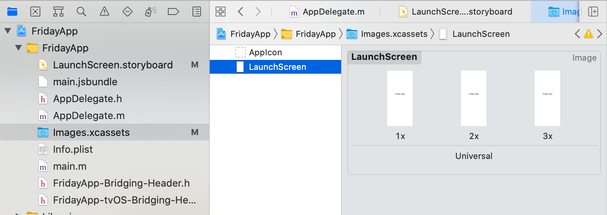

# React Native Template - TypeScript

[](./CONTRIBUTING.md)


The project has been setup based off [react-native-typescript-boilerplate](https://github.com/AmitM30/react-native-typescript-boilerplate)

___
## Introduction

An app to summarize some key sections of Robert C Martin's book 'Clean Code'.

- Routing and Navigation
  - Tabbed navigation using [React Native Navigation v7](https://github.com/wix/react-native-navigation)
  - Side Menu support
- State Management using Flux Architecture
  - [Redux](https://redux.js.org/introduction/getting-started)
  - [Redux-Thunk](https://github.com/reduxjs/redux-thunk) middleware
- Typography
  - Base Typography setup - Color, Font, LAYOUT, CTA, FONTS, TEXT, TEXT_INPUT
- Code Lint
  - [Airbnb's JS](https://github.com/airbnb/javascript) Linting

> _Disclaimer_: This is an **opinionated** approach to building apps with RN. The project structure is inspired by multiple production apps built by the contributors.

##### App Screens

|  |  | |
| :-------------------------------------------------------: | :---------------------------------------------------: | :---------------------------------------------------: |

### Table of Contents

- [Project Structure](#project-structure)
- [Getting Started](#getting-started)
- [Cheat Sheet](#cheat-sheet)
  - [Single Screen vs Tabbed Based Navigation](#single-screen-vs-tabbed-based-navigation)
  - [Renaming the App](#renaming-the-app)
  - [iOS Launch Screen](#ios-launch-screen)
  - [Android Launch Screen](#android-launch-screen)
- [Contributing](#contributing)
- [TODO](#todo)

### Project Structure

```
/
├── android					Android Native code
├── ios						iOS Native Code
├── shared
│   ├── redux					Applications Logic
│   │   ├── constants
│   │   ├── actions
│   │   ├── api
│   │   ├── reducers
│   │   ├── store
│   │   └── thunk
│   └── utilities
├── src
│   ├── config					Global Configuration
│   ├── constants				Screens, Localization
│   ├── navigators				Router, Navigation
│   ├── view					UI compoments
│   │   ├── assets
│   │   ├── screens
│   │   ├── styles				  Typography
│   │   └── widgets				  Custom components
│   └── utilities
├── __tests__					Unit Tests
│   ├── presentation
│   └── redux
├── .babelrc
├── .gitignore
├── .travis.yml					Travis CI
├── tsconfig.json				TypeScript Configuration
├── tslint.js					TSLint configuration - extending AirBnb
├── tsconfig.json
├── app.json
├── index.js					Application Entry point
├── package.json
└── README.md
```

`shared`
Everything related to application business logic. The redux store.

`src`
Presentation layer for the app - screens, styles, images, icons etc.

### Getting Started

Make sure node version installed is `>=10.x.x`. Then install using yarn (or npm):
```
yarn install
```

Start the Metro Bundler:
```
yarn start
```

###### iOS

One time. Move to `ios` folder and install pods:

```
cd ios && pod install
```

Launch application from XCode (`Command + R`) Or launch from Terminal:

```
yarn ios
# runs the following command. change device name here
# `npx react-native run-ios --simulator='iPhone 11'`
```

###### Android

Start an Android Simulator from:
```
Android Studio > Tools > AVD Manager > Run any device
```

Similarly, run from Android Studio itself Or from Terminal:
```
yarn android
# runs the following command
# react-native run-android --variant=Debug
```

### Cheat Sheet

#### iOS Launch Screen

```shell
XCode -> Project Folder -> Click on `Images.xcassets` -> Click on `LaunchScreen`
```

Change the 3 images here to set the new launch screen for iOS.



#### Android Launch Screen

```shell
`./android/app/src/main/res/drawable-*` folders
```

Change the images the `drawable-*` folders to set the new launch screen for Android.

#### Single Screen vs Tabbed Based Navigation

The application launches with a splash screen, and then moves to a tabbed based navigation. Splash screen is a good place to fetch data / build application launch logic like getting user token from API or Async Store, load persist state etc.

For Single screen application, replace this tabbed based navigation with a single screen - just `home`, or simply use the splash screen to setup the app, may be with a burger menu.

#### Renaming the App

You might also want to rename the app for your own use. Follow any of the links below.
- [How to Rename A React Native App](https://medium.com/the-react-native-log/how-to-rename-a-react-native-app-dafd92161c35)

Or

- NPM Package: [react-native-rename](https://www.npmjs.com/package/react-native-rename)

### Contributing

Please check out [Contributing](https://github.com/AmitM30/react-native-typescript-boilerplate/blob/master/CONTRIBUTING.md).

### Authors

- [**Mike Murtagh**](https://github.com/mjmurtag)

See also the list of [contributors](https://github.com/AmitM30/react-native-typescript-boilerplate/contributors).
