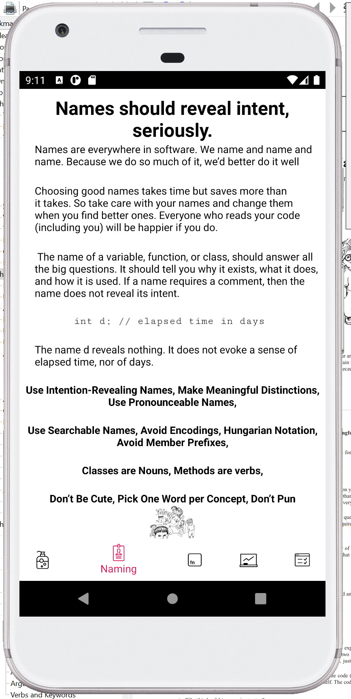

# Showcasing Clean Code by Robert C Martin - TypeScript, React Native, Redux
[](https://github.com/mjmurtag/CleanCodeApp/actions/workflows/main-PR.yml)
[](./CONTRIBUTING.md)


The project has been setup based off [react-native-typescript-boilerplate](https://github.com/AmitM30/react-native-typescript-boilerplate)

___
# Introduction

An app to summarize some key sections of Robert C Martin's book 'Clean Code'. [Clean Code PDF](https://enos.itcollege.ee/~jpoial/oop/naited/Clean%20Code.pdf) 


## Technical Details:
- Routing and Navigation
  - Tabbed navigation using [React Native Navigation v7](https://github.com/wix/react-native-navigation)
  - Side Menu support
- State Management using Flux Architecture
  - [Redux](https://redux.js.org/introduction/getting-started)
  - [Redux-Thunk](https://github.com/reduxjs/redux-thunk) middleware
- Typography
  - Base Typography setup - Color, Font, LAYOUT, CTA, FONTS, TEXT, TEXT_INPUT
- Code Lint
  - [Airbnb's JS](https://github.com/airbnb/javascript) Linting

> _Disclaimer_: This is an **opinionated** approach to building apps with RN. The project structure is inspired by multiple production apps built by the contributors.

##### App Screens

|  |  | |
| :-------------------------------------------------------: | :---------------------------------------------------: | :---------------------------------------------------: |

|  |  | |
| :-------------------------------------------------------: | :---------------------------------------------------: | :---------------------------------------------------: |
|  |  | |


# Clean Code Concepts Covered:
## Why Clean Code? Be aware of the total cost of owning a mess.
  'When hand-washing was first recommended to physicians by Ignaz Semmelweis in 1847, it was rejected on the basis that doctors were too busy and wouldn’t have time to wash their hands between patient visits.',
  'You have time to write clean code',

  'Bjarne Stroustrup, inventor of C++ says:',
  '"I like my code to be elegant and efficient. The logic should be straightforward to make it hard for bugs to hide, the dependencies minimal to ease maintenance, error handling complete according to an articulated strategy, and performance close to optimal so as not to tempt people to make the code messy with unprincipled optimizations. Clean code does one thing well."',

  'Without Clean Code, your teams\' productivity will suffer eventually.',

  'Discover. Teach. Adcovate.'

  ## Naming 
  'Names should reveal intent, seriously.',

  'Names are everywhere in software. We name and name and name. Because we do so much of it, we’d better do it well',
  'Choosing good names takes time but saves more than it takes. So take care with your names and change them when you find better ones. Everyone who reads your code (including you) will be happier if you do.',

  ' The name of a variable, function, or class, should answer all the big questions. It should tell you why it exists, what it does, and how it is used. If a name requires a comment, then the name does not reveal its intent.',

  `int d; // elapsed time in days`

  ### The name d reveals nothing. It does not evoke a sense of elapsed time, nor of days
  

  #### Use Intention-Revealing Names, Make Meaningful Distinctions, Use Pronounceable Names

  #### Use Searchable Names, Avoid Encodings, Hungarian Notation, Avoid Member Prefixes

  #### Classes are Nouns, Methods are verbs,

  Don’t Be Cute, Pick One Word per Concept, Don’t Pun
## Functions - Small!

  The first rule of functions is that they should be small.

   The second rule of functions is they should be smaller than that. 
   
   This is not an assertion that I can justify. I can’t provide any references to research that shows that very small functions are better.

  'What experience has taught me, through long trial and error, is that functions should be very small.',

  Do One Thing

  One Level of Abstraction per Function

  Reading Code from Top to Bottom: The Stepdown Rule: As code executes, it should ideally step down by one function at a time
## Classes - Small!
  The first rule of classes is that they should be small. The second rule of classes is they should have a SINGLE responsibility.

  This involves ensuring code is coherantly organized so others can understand what the intent of the code was.

  Maintaining cohesion results in many small classes

  Smaller functions and smaller classes go together. Code organization should allow future changes easily.

  'Decoupling of logic promotes flexibility for the future.'
## Unit Tests - The Three Laws of TDD
  ### First Law

  'You may not write production code unitl you have written a failing unit test.',
  ### Second Law
  'You may not write more of a unit test than is sufficient to fail, and not compiling is failing.',

  ### Third Law
  'You may not write more production code than is sufficient to pass the currently failing test',
  ### Keep Tests Clean
  'What makes a clean test? Three things. Readability, readability, and readability. Read- ability is perhaps even more important in unit tests than it is in production code.',

  “Complexity kills. It sucks the life out of developers,it makes products difficult to plan, build, and test.” —Ray Ozzie, CTO, Microsoft Corporation
];

### Table of Contents

- [Project Structure](#project-structure)
- [Getting Started](#getting-started)
- [Cheat Sheet](#cheat-sheet)
  - [Single Screen vs Tabbed Based Navigation](#single-screen-vs-tabbed-based-navigation)
  - [Renaming the App](#renaming-the-app)
  - [iOS Launch Screen](#ios-launch-screen)
  - [Android Launch Screen](#android-launch-screen)
- [Contributing](#contributing)
- [TODO](#todo)

### Project Structure

```
/
├── android					Android Native code
├── ios						iOS Native Code
├── shared
│   ├── redux					Applications Logic
│   │   ├── constants
│   │   ├── actions
│   │   ├── api
│   │   ├── reducers
│   │   ├── store
│   │   └── thunk
│   └── utilities
├── src
│   ├── config					Global Configuration
│   ├── constants				Screens, Localization
│   ├── navigators				Router, Navigation
│   ├── view					UI compoments
│   │   ├── assets
│   │   ├── screens
│   │   ├── styles				  Typography
│   │   └── widgets				  Custom components
│   └── utilities
├── __tests__					Unit Tests
│   ├── presentation
│   └── redux
├── .babelrc
├── .gitignore
├── .travis.yml					Travis CI
├── tsconfig.json				TypeScript Configuration
├── tslint.js					TSLint configuration - extending AirBnb
├── tsconfig.json
├── app.json
├── index.js					Application Entry point
├── package.json
└── README.md
```

`shared`
Everything related to application business logic. The redux store.

`src`
Presentation layer for the app - screens, styles, images, icons etc.

### Getting Started

Make sure node version installed is `>=10.x.x`. Then install using yarn (or npm):
```
yarn install
```

Start the Metro Bundler:
```
yarn start
```

###### iOS

One time. Move to `ios` folder and install pods:

```
cd ios && pod install
```

Launch application from XCode (`Command + R`) Or launch from Terminal:

```
yarn ios
# runs the following command. change device name here
# `npx react-native run-ios --simulator='iPhone 11'`
```

###### Android

Start an Android Simulator from:
```
Android Studio > Tools > AVD Manager > Run any device
```

Similarly, run from Android Studio itself Or from Terminal:
```
yarn android
# runs the following command
# react-native run-android --variant=Debug
```

### Cheat Sheet

#### iOS Launch Screen

```shell
XCode -> Project Folder -> Click on `Images.xcassets` -> Click on `LaunchScreen`
```

Change the 3 images here to set the new launch screen for iOS.


#### Android Launch Screen

```shell
`./android/app/src/main/res/drawable-*` folders
```

Change the images the `drawable-*` folders to set the new launch screen for Android.

#### Single Screen vs Tabbed Based Navigation

The application launches with a splash screen, and then moves to a tabbed based navigation. Splash screen is a good place to fetch data / build application launch logic like getting user token from API or Async Store, load persist state etc.

For Single screen application, replace this tabbed based navigation with a single screen - just `home`, or simply use the splash screen to setup the app, may be with a burger menu.

#### Renaming the App

You might also want to rename the app for your own use. Follow any of the links below.
- [How to Rename A React Native App](https://medium.com/the-react-native-log/how-to-rename-a-react-native-app-dafd92161c35)

Or

- NPM Package: [react-native-rename](https://www.npmjs.com/package/react-native-rename)

### Contributing

Please check out [Contributing](https://github.com/AmitM30/react-native-typescript-boilerplate/blob/master/CONTRIBUTING.md).

### Authors

- [**Mike Murtagh**](https://github.com/mjmurtag)

See also the list of [contributors](https://github.com/AmitM30/react-native-typescript-boilerplate/contributors).
